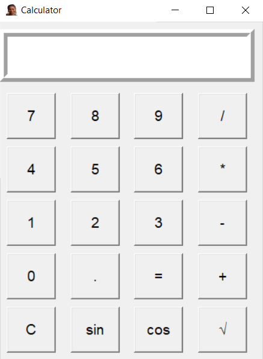

# Tkinter Calculator

A simple yet functional **calculator application** built with **Python's Tkinter library**.  
It supports **basic arithmetic operations**, **trigonometric functions** (sin, cos), and **square root** calculations, all within an intuitive graphical interface.

---

## Features
- **Basic Operations**: Addition, subtraction, multiplication, division.
- **Trigonometric Functions**: `sin` and `cos` (in degrees).
- **Square Root**: Quick √ calculation.
- **Clear Function**: Reset the input instantly.
- **Error Handling**: Displays `Error` for invalid inputs.
- **Modern GUI**: Built using Tkinter with a clean layout.

---

## Screenshot
[](Calculator_Screenshot.png)

---

## Requirements
- Python 3.x
- Tkinter (comes pre-installed with Python)
- `math` module (standard library)

---

## How to Run
1. **Clone this repository**:
   ```bash
   git clone https://github.com/Soniaify/tkinter-calculator.git
   cd tkinter-calculator
2. **Run the script**:
python calculator.py

## Usage
Click buttons to build your expression.
Press = to evaluate.
Use C to clear.
Click sin, cos, or √ for special operations.
Use C to clear.

Click sin, cos, or √ for special operations.
